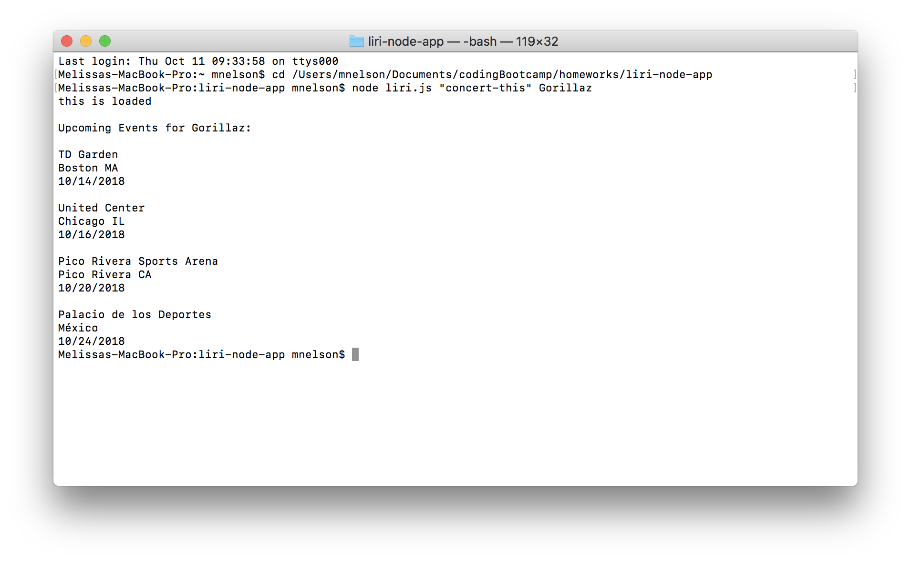
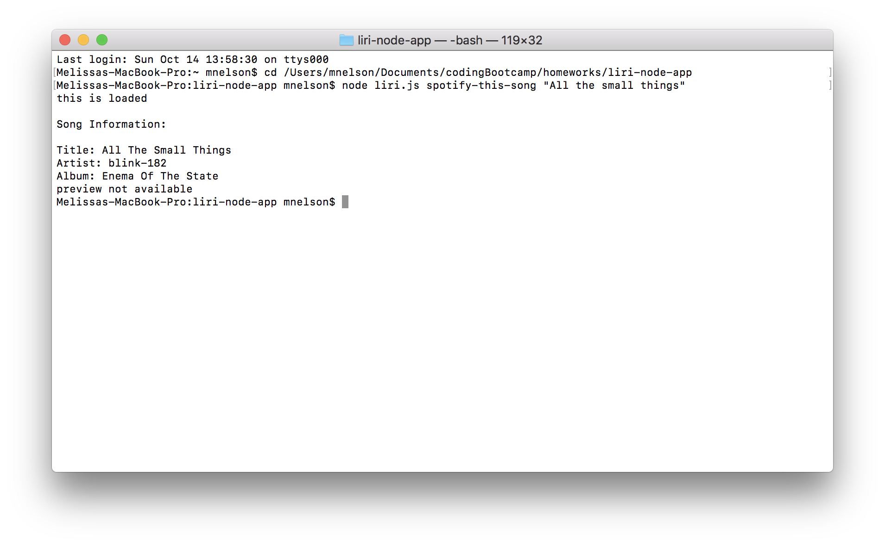
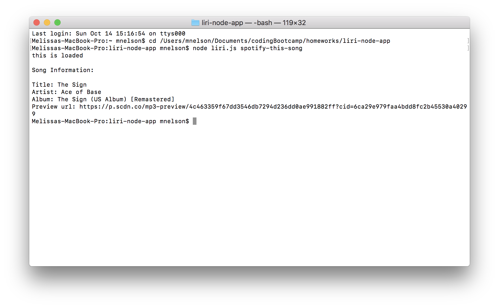
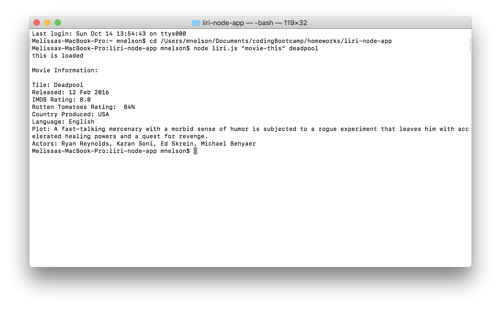
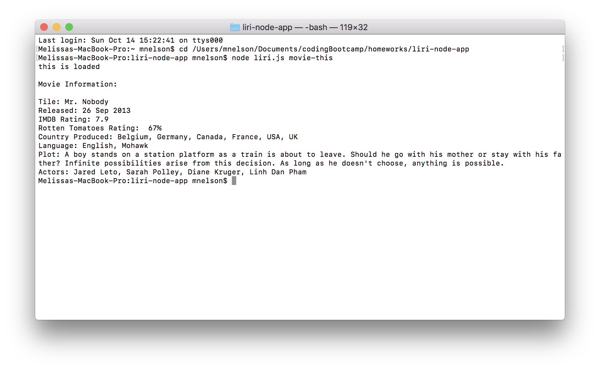
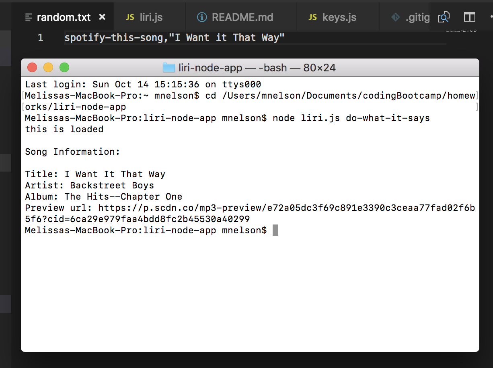
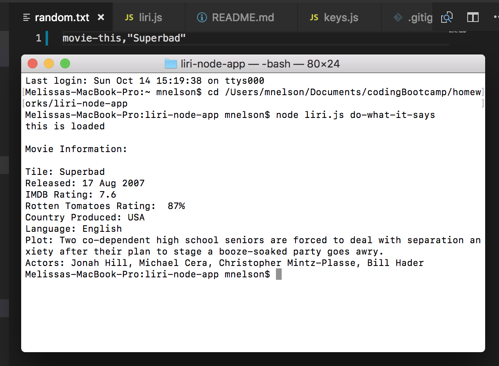
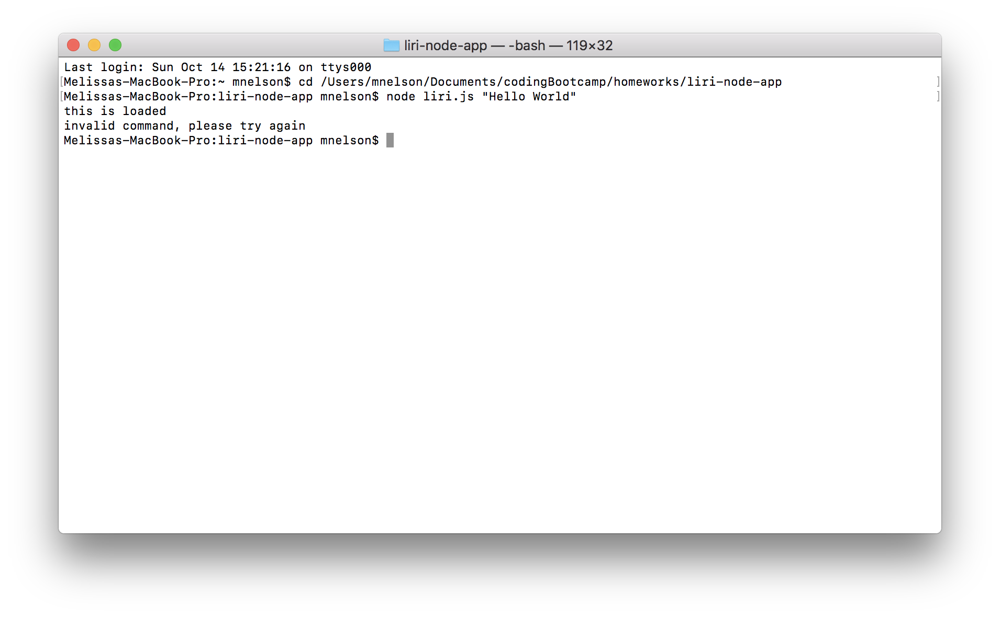
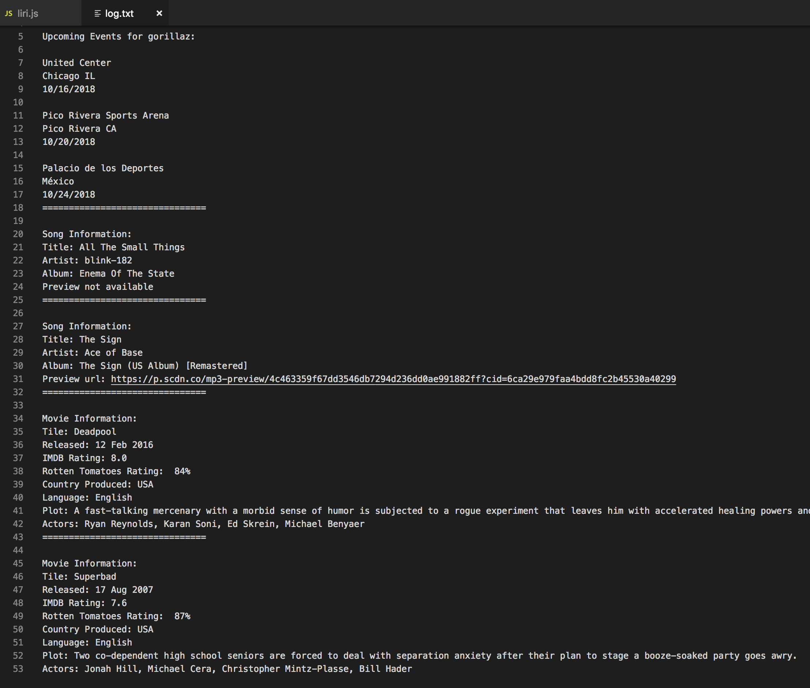

# Liri-node-app

### Instructions/Features 
* Liri is a Language Interpretation and Recognition Interface that uses the command line to take in parameters and give back data
* Concert-this
    * from the command line, enter "concert-this" followed by an artist to show upcoming events for that artist
    * the venue, location, and date for each upcoming event will be listed
    * example output:
    
* Spotify-this-song
    * from the command line, enter "spotify-this-song" followed by a song to show information for that song (artist, album, preview url)
    * the title, artist, album, and a url to a preview of the song will be listed.
    * if there is no preview available, it will state "preview not available"
    * example output:
    
    * if no song is entered, then information for a default song will show:
    
* Movie-this
    * from the command line, enter "movie-this" followed by a movie name to show information for that movie
    * information shown includes title, release date, ratings, plot, actors, and more
    * example output:
    
    * if no movie is entered, then information for a default movie will show:
    
* Do-what-it-says
    * from the command line, entering "do-what-it-says" will take the text from the random.txt file and run the corresponding command
    * example output using "spotify-this-song":
    
    * example output using "movie-this":
    
* If an invalid command is entered, you will be told to try again
    
* All of your command line results will be appended to the "log.txt" file for you to reference your searches later if needed
    

### Languages/Technologies Used:
* JavaScript, Node.js, API requests, Command Line, Moment.js, Request, dotenv

    
